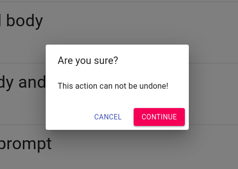

# Mui-Prompt

> Awesome and simple prompt components

with mui-prompt you can easily ask user for confirmation before executing an important action


## Demo

### Dialog



### Inline


#### [Demo](http://nikandlv.github.io/mui-prompt)

## Install it

```console
nikandlv@nikandlv.ir:~$ npm i mui-prompt
```

## Import it

```js
import Prompt from "mui-prompt";
```

## Dialog

### render the prompt view

```jsx
export default class InlineDemo extends React.Component {
  render() {
    function simplePrompt() {
      Prompt.ask("simple", {
        callback: status => {
          console.log(status);
        },
      });
    }

    return (
      <div>
        <Prompt.View />
        <button onClick={simplePrompt}>click me!</button>
      </div>
    );
  }
}
```
